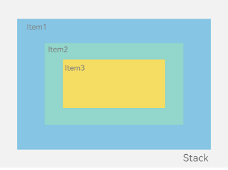

# SwitchUI

<div align="center">
  
  
  
  
</div>

<div align="center">
  <h3>一个简单易用的 Swift 声明式 UI 框架</h3>
</div>

<div align="center">
  <p>
    <a href="#特性">特性</a> •
    <a href="#安装">安装</a> •
    <a href="#组件">组件</a> •
    <a href="#布局容器">布局容器</a> •
    <a href="#注意事项">注意事项</a>
  </p>
</div>

<div align="center">
  <p>
    <b>SwitchUI</b> 是一个基于 Swift 的声明式 UI 框架，提供了一套类SwiftUI和ArkUI的布局系统和控件，最低支持 iOS 10.0+ 不依赖系统独立升级, 用不了SwiftUI的都可以来用这个
  </p>
</div>

## 特性

- �� 声明式语法，代码简洁直观
- 📱 支持 iOS 10.0+
- 🎨 布局容器基本和SwitchUI和ArkUI一致，满足各种布局需求
- 🔄 支持布局和属性发生变更UI自动刷新
- 🛠 链式调用，使用便捷
- 📦 支持 CocoaPods 集成

## 安装

### CocoaPods

```ruby
pod 'SwitchUI'
```

## 架构图


## 与Yoga、Masonry等框架的布局效率对比
待补充

## 组件

### 数值设置

支持：

* "100%" 父容器宽度百分比

* "100%-N" 父容器宽度百分比 减 具体数值&#x20;

* "100%+N" 父容器宽度百分比 加 具体数值&#x20;

* "50vw" 屏幕宽度的50%

* "50vh" 屏幕高度的50%

* 10  具体的某一个数值

范例

```swift
UILabel()
.width("100%")
.width("100%-50")
.width("50vw")
.width("50vh")
.width(10)
```

**UIColor**

支持：6/8位16进制字符串

* \#000000

* \#00000000

* 0x000000

* 0x00000000

### 通用属性

#### width

`设置宽度值`

范例

```swift
UILabel()
.width("100%")
.width("100%-50")
.width("50vw")
.width("50vh")
.width(10)
```

#### height

`设置高度值`

范例

```swift
UILabel()
.height("100%")
.height("100%-50")
.height("50vw")
.height("50vh")
.height(10)
```

#### left

`设置左边距值`

范例

```swift
UILabel()
.left("100%")
.left("100%-50")
.left("50vw")
.left("50vh")
.left(10)
```

#### top

`设置顶边距值`

示意

```swift
UILabel()
.top("100%")
.top("100%-50")
.top("50vw")
.top("50vh")
.top(10)
```

#### right

`设置右边距值`

示意

```swift
UILabel()
.right("100%")
.right("100%-50")
.right("50vw")
.right("50vh")
.right(10)
```

#### bottom

`设置底部距值`

示意

```swift
UILabel()
.bottom("100%")
.bottom("100%-50")
.bottom("50vw")
.bottom("50vh")
.bottom(10)
```

#### centerX

`设置中心横向坐标值`

示意

```swift
UILabel()
.centerX("100%")
.centerX("100%-50")
.centerX("50vw")
.centerX("50vh")
.centerX(10)
```

#### centerY

`设置中心纵向坐标值`

示意

```swift
UILabel()
.centerY("100%")
.centerY("100%-50")
.centerY("50vw")
.centerY("50vh")
.centerY(10)
```

#### isUseSWUI

`获取组件是否使用了SWUI布局`

#### enableSWUI

`允许组件使用SWUI布局，默认被布局加载的控件此值为YES`

### 自定义控件

#### SBlank

在 Row布局和Column布局中，自动充满剩余空白位置的控件，当有多个时，多个平分空白内容

```swift
SRow([
    UILabel()
        .left(iPad ? 24 :16)
        .text("所有推送通知")
        .textColor("#393548")
        .font(UIFont.systemFont(ofSize: iPad ? 24 : 16)),

    SBlank(),

    SRow([
        UISwitch()
            .setTintColor(UIColor(hexString: "#D4D1DD"))
            .setOnTintColor(UIColor(hexString: "#FFD633"))
            .top(4)
            .setOn({ _ in self.isOpen.boolValue}, [self.isOpen])
            .setTransform(CGAffineTransform(scaleX: (iPad ? 1 : 0.8), y: (iPad ? 1 : 0.8)))
    ])
])
```

#### SButton

使用

```swift
SButton()
.image(UIImage(named: "setting_ic"), state: .normal)
.width(24)
.height(24)
.right(22.0)
.top(51.0 + Float(PortraitStatusBarHeight))
.onClick({ [weak self] sender in
    guard let self = self else { return }

})
```
#### SLabel

提供比UILabel更丰富的基础能力

#### SBlank

布局占位控件

#### SWAlertView

弹框控件

#### SWLoadingView

loading控件

#### SWToastView

toast控件

#### SWSegmentView

滑块控件

#### SWSheetView

基础弹框控件

## 布局容器通用属性

#### padding

`设置上下左右边距`

示意

```swift
SColum()
.padding(UIEdgeInsets(top: 30, left: 10, bottom: 30, right: 10))
.paddingTop(10.0)
.paddingLeft(10.0)
.paddingRight(10.0)
.paddingBottom(10.0)
.paddingVertical(10.0)
.paddingHorizontal(10.0)
```

#### s_radius
`设置上下左右自定义圆角，可同时搭配 s_borderColor、s_borderWidth、s_backgroundColor使用`

示意

```swift
SColum()
.s_radius(SRadius.init(topLeft: 22.0, topRight: 22.0, bottomLeft: 0, bottomRight: 0))
```
#### s_borderColor

`设置上下左右自定义边框颜色，可同时搭配 s_radius、s_borderWidth、s_backgroundColor使用`

示意

```swift
SColum()
.s_borderColor(SBorderColor.init(left: "0x000000", right: "0x000000", top: "0x000000", bottom: "0x000000"))
```
#### s_borderWidth

`设置上下左右自定义边框颜色，可同时搭配 s_radius、s_borderColor、s_backgroundColor使用`

示意

```swift
SColum()
.s_borderWidth(SBorderWidth.init(left: 1.0, right: 0, top: 0, bottom: 1))
```

#### s_backgroundColor

`设置背景自定义颜色，需同时搭配 s_radius、s_borderColor、s_borderWidth使用才好使`

示意

```swift
SColum()
.s_backgroundColor("0x000000")
```

## 布局容器构造器

#### 数组构造器

`通过数组的方式构造容器`

示意

```swift
SRelativeContainer([
            SColum([
                UILabel()
                    .text(self.title)
                    .numberOfLines(0)
                    .textColor(.white)
                    .bottom(10.0)
                    .numberOfLines(0),
                UIActivityIndicatorView(style: .white)
                    .width(30)
                    .height(30)
                    .callSelf(&self.activity)
                    .start()
            ])
            .alignContent(.center)
            .cornerRadius(10)
            .padding(UIEdgeInsets(top: 30, left: 10, bottom: 30, right: 10))
            .width("100")
            .height("100%")
            .alignRules([
                .centerX : [SAnchor: SSuperContainer, SAlign: SWPositionType.centerX],
                .centerY : [SAnchor: SSuperContainer, SAlign: SWPositionType.centerY]
            ])
        ])
        .width("100%")
        .height("100%")
```

#### 闭包构造器

`通过闭包的方式构造容器`

示意

```swift
            SRow({ elements in
                
                    elements.append(
                    UILabel()
                    .text(self.title)
                    .numberOfLines(0)
                    .textColor(.white)
                    .top(30.0)
                    .numberOfLines(0)
                    )
                }),
```

#### Reloader构造器

`通过Reloader绑定SState变量自动刷新子view构造容器`

示意

```swift
            SGrid(
                SReloader({
                var sender: [UIView] = []
                var index: Int = 0
                _ = self.sentenceTypes.map({ model in
                    sender.append(
                        UIButton()
                            .setTitle(model.name, state: .normal)
                            .setTitleColor(UIColor.white, state: .normal)
                            .titleFont(UIFont(name: SYSTEM_Medium_FONT, size: 10)!)
                            .backgroundColor({ sender in
                                self.selectIndex.intValue == sender.tag ? UIColor.init(hexString: model.selectColor) : UIColor.black.withAlphaComponent(0.25)
                            }, [self.selectIndex])
                            .left(10)
                            .width(50)
                            .height(15)
                            .cornerRadius(7.5)
                            .tag(index)
                            .onClick({ [weak self] x in
                                self?.selectIndex.value = x.tag
                            })
                    )
                    index+=1
                })
                return sender
            }, [reloadList]))
```

#### SForEach对象

`通过ForEach对象创建批量子view`

示意

```swift
// 列表
                SList(SForEach(list: self.rateList, { item, index in
                    SListItem([
                        UILabel()
                            .text(String("x \(item)"))
                            .font(UIFont.init(name: SYSTEM_Medium_FONT, size: 10)!)
                            .textColor({ _ in
                                if self.rateIndex.intValue == index {
                                    return "#FFA500"
                                } else {
                                    return "#6D7278"
                                }
                            }, [self.rateIndex])
                            .width("100%")
                            .height(30)
                            .textAlignment(.center)
                            .onClick { [weak self] _ in
                                guard let self = self else {return}
                                
                            }
                    ])
                }))
                .width("100%")
                .height(150.0),
```


## 布局容器

### Row布局

> 布局内的子view，从左到右垂直排列

Row容器内子元素排列示意图


#### 属性

##### scrollType

滚动配置值：

* none           // 默认，不滚动

* auto           // 如果内容被修剪，则会显示滚动条以便查看其余的内容。

* scrollx        // 如果横向会被修剪，则会显示滚动条

* scrolly        // 如果竖向会被修剪，则会显示滚动条

##### alignContent

横向排列：

* left   // 左

* center // 中

* right  // 右

##### justifyContent

纵向排列：

* top   // 上

* center // 中

* bottom  // 下

#### 使用

```swift
SRow([
    UILabel()
    .left(16)
    .text("Row布局")
    .textColor("#393548")
    .font(UIFont.systemFont(ofSize: 16))
]).width("100%")
    .left(16)
    .right(16)
    .height("100%")
    .cornerRadius(5)
    .backgroundColor("#e8e8e7")
    .justifyContent(.center)
    .onClick { _ in

    }
```

### Column布局

> 布局内的子view，从上到下垂直排列

Column容器内子元素排列示意图


#### 属性

##### scrollType

滚动配置值：

* none           // 默认，不滚动

* auto           // 如果内容被修剪，则会显示滚动条以便查看其余的内容。

* scrollx        // 如果横向会被修剪，则会显示滚动条

* scrolly        // 如果竖向会被修剪，则会显示滚动条

##### alignContent

横向排列：

* left   // 左边

* case center // 中间

* case right  // 右边

#### 使用

```swift
SColumn([
    UILabel()
    .left(16)
    .text("Column布局")
    .textColor("#393548")
    .font(UIFont.systemFont(ofSize: 16))
]).width("100%")
    .left(16)
    .right(16)
    .height("100%")
    .cornerRadius(5)
    .backgroundColor("#e8e8e7")
    .justifyContent(.center)
    .onClick { _ in

    }
```

### RelativeContainer布局

> 关系型相对布局，可以添加控件之间的关于约束来相对布局

相对布局示意图


子元素并不完全是上图中的依赖关系。比如，Item4可以以Item2为依赖锚点，也可以以RelativeContainer父容器为依赖锚点。

#### 使用

```swift
SRelativeContainer([

            // 左上角广告
            UIImageView(image: UIImage(named: "vip_alert_ad"))
                .width(228.0)
                .height(89.0)
                .left(23.0)
                .top(38.0)
                .viewId("ad"),
            // 钻石
            UIImageView(image: UIImage(named: "vip_diamond"))
                .width(85.0)
                .height(66.0)
                .left(18.0)
                .viewId("diamond")
                .alignRules([
                    .left: [SAnchor: "ad", SAlign: SWPositionType.right],
                    .top: [SAnchor: "ad", SAlign: SWPositionType.top]
                ]),
                // 关闭按钮
            UIImageView(image: UIImage(named: "scene_ic_close"))
                .width(35.0)
                .height(35.0)
                .viewId("close")
                .right(5)
                .alignRules([
                .centerX: [SAnchor: SSuperContainer, SAlign: SWPositionType.centerX],
                .centerY: [SAnchor: SSuperContainer, SAlign: SWPositionType.centerY]
            ]),
])


```

### Stack布局

> 布局内的子view，中心在中心店堆叠布局

Stack作为容器，容器内的子元素的顺序为Item1->Item2->Item3。

层叠布局




#### 使用

```swift
SStack([
    UILabel()
    .left(16)
    .text("Column布局")
    .textColor("#393548")
    .font(UIFont.systemFont(ofSize: 16))
]).width("100%")
    .left(16)
    .right(16)
    .height("100%")
    .cornerRadius(5)
    .backgroundColor("#e8e8e7")
    .justifyContent(.center)
    .onClick { _ in

    }
```

### Grid布局

#### 属性

##### rowSpace

行间距


##### columSpace

列间距


##### rowsNumber

每行排列的子view数量

##### columsNumber

每列排列的子view数量

##### scrollType

滚动类型

##### autoSplit

是否自动排列位置，默认false

##### itemWidth

每个项的宽度

##### itemHeight

每个项的高度

### List布局

#### 布局与约束

列表作为一种容器，会自动按其滚动方向排列子组件，向列表中添加组件或从列表中移除组件会重新排列子组件。

如下图所示，在垂直列表中，List按垂直方向自动排列ListItemGroup或ListItem。

ListItemGroup用于列表数据的分组展示，其子组件也是ListItem。ListItem表示单个列表项，可以包含单个子组件。

**图1** List、ListItemGroup和ListItem组件关系


```swift
说明
List的子组件必须是ListItemGroup或ListItem，ListItem和ListItemGroup必须配合List来使用。
```

#### 子元素

##### ListItem

List组件的表示行的一个元素，每个ListItem代表一行或一列。

* 在垂直滚动方式中，布局能力相当于 Row

* 在水平滚动方式中，布局能力相当于Column

```swift
SListItem([
    UILabel()
    .text("Row布局")
    .textColor("#393548")
    .font(UIFont.systemFont(ofSize: 16))
    .width("100%")
    .height(50)
]).paddingLeft(16)
    .cornerRadius(5)
    .clipsToBounds(true)
    .backgroundColor("#e8e8e7")
    .onClick({ _ in
        self.navigationController?.pushViewController(Row(nibName: nil, bundle: nil), animated: true)
    }),
```

##### ListItemGroup

项view的组对象，用来包含一组ListItem

* 在垂直滚动方式中，布局能力相当于 Row

* 在水平滚动方式中，布局能力相当于Column

* ListGroupItem中只能放ListItem

```swift
SList([
    SListItem([
        UILabel()
        .text("Row布局")
        .textColor("#393548")
        .font(UIFont.systemFont(ofSize: 16))
        .width("100%")
        .height(50)
    ]).paddingLeft(16)
        .cornerRadius(5)
        .clipsToBounds(true)
        .backgroundColor("#e8e8e7")
        .onClick({ _ in

        }),
    SListGroupItem([
        SListItem([
            UILabel()
            .text("Column布局")
            .textColor("#393548")
            .font(UIFont.systemFont(ofSize: 16))
            .width("100%")
            .height(50)
        ]).paddingLeft(16)
            .cornerRadius(5)
            .clipsToBounds(true)
            .backgroundColor("#e8e8e7")
            .onClick({ _ in

            })
    ]),

    SListItem([
        UILabel()
        .text("SButton")
        .textColor("#393548")
        .font(UIFont.systemFont(ofSize: 16))
        .width("100%")
        .height(50)
    ]).paddingLeft(16)
        .cornerRadius(5)
        .clipsToBounds(true)
        .backgroundColor("#e8e8e7")
        .onClick({ _ in

        }),
]).width("100%")
    .height("100%-74")
    .top(74)
    .space("10")
    .paddingHorizontal(16)
```

#### 属性

##### scrollType

滚动类型

##### space

间距

#### 使用

```swift
SList([
    SListItem({
        UILabel()
            .text("Row布局")
            .textColor("#393548")
            .font(UIFont.systemFont(ofSize: 16))
    }),

    SListItem({
        UILabel()
            .text("Row布局")
            .textColor("#393548")
            .font(UIFont.systemFont(ofSize: 16))
    }),   
])
.width("100%")
.height("100%-74")
.top(74)
.space("10")
```

### 绝对布局-position

> 当我们要固定一个元素，不受其他布局限制和排版可以使用绝对布局属性

#### 使用

```swift
SStack([])
.width("100%")
.height("100%")
.position([.centerX: "50%", .top: "6"])
.position([.top: -10])
.position([.centerX: "50%", .centerY: "50%"])
```


## 属性自动绑定 & UI自动刷新

#### SState

声明

```swift
var selectIndex: SState = SState(0)
```

绑定属性变更触发器

```swift
UIButton()
.backgroundColor({ sender in

}, [self.selectIndex])
```

自动刷新绑定组件UI，数值发生改变的时候，属性就会触发自动刷新，如果涉及到UI的属性发生变更则刷新最小UI树

```swift
self.selectIndex.value = x.tag
```

## 组件管理中心

组件有一个`组件管理中心`SUIManager，基于SWUI创建的组件会自动注册到`组件管理中心`里面，管理中心有以下作用：

* 管理所有使用SWUI创建的控件

* 控制组件主动刷新

* 查找组件

**注意：正常我们创建的SWUI控件会自动创建ViewId并注册到组件管理中心**

**手动指定控件Id**

```swift
.viewId("view1")

UILabel()
.left(50)
.text("内容4")
.textColor("#393548")
.font(UIFont.systemFont(ofSize: 16))
.viewId("view1")
```

**获取组件对象**

```swift
SUIManager.shared.findComponents(viewId: viewId)
```

## 注意事项

1. 容器尺寸计算：
   
   - 如果未设置固定尺寸，容器会自动计算所需尺寸
   - 某些容器（如 SColum、SRow）需要设置宽度或高度才能正确布局

2. 滚动配置：
   
   - 使用 `scrollType` 设置滚动方向
   - 可以隐藏滚动条

3. 性能优化：
   
   - 避免过深的嵌套层级
   - 合理使用空白占位符
   - 适当设置固定尺寸

## 贡献

欢迎提交 Issue 和 Pull Request。

## 许可证

MIT License
