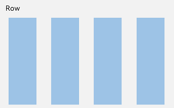
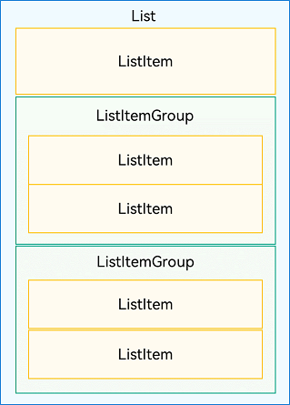

# 一、背景

在今年学习了鸿蒙ArkUI开发后，感叹前端UI框架效率之高，再想想iOS的UI开发一言难尽，我们由于版本限制还没发使用SwiftUI，所以萌生了自己写一个声明式UI框架的想法，所以利用周末和业余时间，开始研究怎么实现一个类ArkUI的声明式框架，经过几个月的编写，1.0版本已经基本实现完毕。

# 二、总体介绍

### **Why**

* iOS侧的yoga框架复杂布局问题太多，维护成本高

* 使用纯Frame写UI，代码量多，手动处理内容太多，效率十分低下

* 动态性较差和各UI框架无法结合使用

### How

#### 导入

```objc

// 导入SwitchUI库
#import SwitchUI

```

#### 声明式UI框架的能力列举

1. SwiftUI、ArkUI 等声明式UI实现了哪些功能
   
   1. 声明式调用语法和组件 已实现
      
      1. Label
      
      2. Button
      
      3. View
      
      4. ImageView
      
      5. TableView
   
   2. 布局容器  已实现
      
      1. Row
      
      2. Column
      
      3. Strack
      
      4. Grid
      
      5. List
   
   3. 自定义标记自触发式变量  例如： @State @Prop @Link 已实现
      
      1. 属性设置函数化，调用的属性相当于设置了一个属性闭包函数
      
      2. 使用自定义标记变量，把变量变成一个监听对象
      
      3. 变量的作用域池，共享变量状态
      
      4. 状态变量自动绑定对应属性和逻辑&#x20;
      
      5. 当状态发生变化会把绑定的UI控件属性和逻辑进行重新触发调用
   
   4. UI刷新  已实现
      
      1. UI组件发生尺寸更新后，自动更新UI树
      
      2. UI更新使用事件循环，一定时间内更新一次UI组件布局
      
      3. UI更新最小化颗粒度更新

### What

#### 架构图


#### **收益**

* UI编写和维护效率提升**30%**(评估)

* 解决低版本OS无法使用声明式框架问题

* 省去了细小的View的编写和不用编写冗余的布局代码

* 可以和其他布局框架结合互不影响

#### 与各UI框架开发效率对比


# 三、组件

### 数值设置

**SValue**

支持：

* "100%" 父容器宽度百分比

* "100%-N" 父容器宽度百分比 减 具体数值&#x20;

* "100%+N" 父容器宽度百分比 加 具体数值&#x20;

* "50vw" 屏幕宽度的50%

* "50vh" 屏幕高度的50%

* 10  具体的某一个数值

范例

```swift
UILabel()
.width("100%")
.width("100%-50")
.width("50vw")
.width("50vh")
.width(10)
```

**UIColor**

支持：6/8位16进制字符串

* \#000000 &#x20;

* \#00000000

* 0x000000

* 0x00000000

### 通用属性

#### width

`设置宽度值`

范例

```swift
UILabel()
.width("100%")
.width("100%-50")
.width("50vw")
.width("50vh")
.width(10)
```

#### height

`设置高度值`

范例

```swift
UILabel()
.height("100%")
.height("100%-50")
.height("50vw")
.height("50vh")
.height(10)
```

#### left

`设置左边距值`

范例

```swift
UILabel()
.left("100%")
.left("100%-50")
.left("50vw")
.left("50vh")
.left(10)
```

#### top

`设置顶边距值`

示意

```swift
UILabel()
.top("100%")
.top("100%-50")
.top("50vw")
.top("50vh")
.top(10)
```

#### right

`设置右边距值`

示意

```swift
UILabel()
.right("100%")
.right("100%-50")
.right("50vw")
.right("50vh")
.right(10)
```

#### bottom

`设置底部距值`

示意

```swift
UILabel()
.bottom("100%")
.bottom("100%-50")
.bottom("50vw")
.bottom("50vh")
.bottom(10)
```

#### centerX

`设置中心横向坐标值`

示意

```swift
UILabel()
.centerX("100%")
.centerX("100%-50")
.centerX("50vw")
.centerX("50vh")
.centerX(10)
```

#### centerY

`设置中心纵向坐标值`

示意

```swift
UILabel()
.centerY("100%")
.centerY("100%-50")
.centerY("50vw")
.centerY("50vh")
.centerY(10)
```

#### isUseSWUI

`获取组件是否使用了SWUI布局`

#### enableSWUI

`允许组件使用SWUI布局，默认被布局加载的控件此值为YES`

#### zIndex

`设置视图的层级顺序（Z轴位置）`

数值越大，视图越靠前显示

示意

```swift
UIView()
    .width(100)
    .height(100)
    .backgroundColor(.red)
    .zIndex(10)  // 在其他视图之上
```

#### overlay

`在当前视图上叠加一个覆盖层`

可以在视图上方添加额外的视图层，常用于蒙层、浮动按钮等

示意

```swift
UIView()
    .width(200)
    .height(200)
    .backgroundColor(.blue)
    .overlay(
        UILabel()
            .text("覆盖层")
            .textColor(.white)
    )
```

#### aspectRatio

`设置视图的宽高比`

设置后，如果只指定宽度，高度会自动计算；如果只指定高度，宽度会自动计算

示意

```swift
UIImageView()
    .width(200)
    .aspectRatio(16.0/9.0)  // 宽高比 16:9，高度自动计算为 112.5
```

#### callSelf

`获取当前视图的引用`

方便在链式调用中获取视图对象，支持闭包和指针两种方式

示意

```swift
// 方式1：使用闭包
UILabel()
    .text("标题")
    .callSelf({ view in
        print("当前视图：\(view)")
        // 可以在这里做额外操作
    })

// 方式2：使用指针获取
var myLabel: UILabel?
UILabel()
    .text("标题")
    .callSelf(&myLabel)
// 之后可以使用 myLabel 引用
```

#### viewId

`设置视图的唯一标识符`

用于在组件管理中心查找和管理视图，如果不设置会自动生成UUID

示意

```swift
UILabel()
    .text("标题")
    .viewId("myTitleLabel")

// 之后可以通过 viewId 查找
let label = SUIManager.shared.findComponents(viewId: "myTitleLabel")
```

#### tag

`设置视图的标签值`

UIView 原生属性，用于标识视图

示意

```swift
UIButton()
    .setTitle("按钮1", state: .normal)
    .tag(100)
    .onClick({ sender in
        print("点击了 tag 为 \(sender.tag) 的按钮")
    })
```

#### anchorPoint

`设置视图的锚点`

锚点是视图的参考点，影响旋转、缩放等变换的中心点，默认为 (0.5, 0.5) 即中心点

示意

```swift
UIView()
    .width(100)
    .height(100)
    .anchorPoint(CGPoint(x: 0, y: 0))  // 左上角为锚点
    .backgroundColor(.red)
```

#### visible

`设置视图是否可见`

true 为显示，false 为隐藏

示意

```swift
var isShow: SState = SState(true)

UILabel()
    .text("提示信息")
    .visible({ _ in
        return self.isShow.boolValue
    }, [self.isShow])

// 改变状态，UI 自动更新
self.isShow.value = false  // 视图隐藏
```

#### isUserInteractionEnabled

`设置视图是否响应用户交互`

false 时视图不响应点击等用户事件

示意

```swift
UIButton()
    .setTitle("按钮", state: .normal)
    .isUserInteractionEnabled(true)
    .onClick({ _ in
        print("按钮被点击")
    })

// 动态控制
var isEnabled: SState = SState(false)
UIButton()
    .setTitle("按钮", state: .normal)
    .isUserInteractionEnabled({ _ in
        return self.isEnabled.boolValue
    }, [self.isEnabled])
```

#### contentMode

`设置视图内容的显示模式`

UIView 的 contentMode 属性，控制内容如何填充视图

示意

```swift
UIImageView()
    .image(UIImage(named: "photo"))
    .width(200)
    .height(200)
    .contentMode(.scaleAspectFill)
    .clipsToBounds(true)
```

#### backgroundColor

`设置背景颜色`

支持 UIColor 对象、十六进制字符串、响应式绑定

示意

```swift
// 方式1：使用 UIColor
UIView()
    .backgroundColor(.red)

// 方式2：使用十六进制字符串
UIView()
    .backgroundColor("#FF0000")
    .backgroundColor("0xFF0000")

// 方式3：响应式绑定
var isSelected: SState = SState(false)
UIView()
    .backgroundColor({ _ in
        return self.isSelected.boolValue ? .blue : .gray
    }, [self.isSelected])
```

#### cornerRadius

`设置圆角半径`

示意

```swift
UIView()
    .width(100)
    .height(100)
    .backgroundColor(.blue)
    .cornerRadius(10)

// 响应式绑定
var radius: SState = SState(5.0)
UIView()
    .cornerRadius({ _ in
        return self.radius.cgfloatValue
    }, [self.radius])
```

#### borderColor

`设置边框颜色`

支持 UIColor 对象和十六进制字符串

示意

```swift
UIView()
    .width(100)
    .height(100)
    .borderColor(.red)
    .borderWidth(2)

// 使用十六进制
UIView()
    .borderColor("#FF0000")
    .borderWidth(2)

// 响应式绑定
var color: SState = SState("#FF0000")
UIView()
    .borderColor({ _ in
        return self.color.stringValue
    }, [self.color])
```

#### borderWidth

`设置边框宽度`

示意

```swift
UIView()
    .width(100)
    .height(100)
    .borderColor(.red)
    .borderWidth(2)

// 响应式绑定
var width: SState = SState(1.0)
UIView()
    .borderWidth({ _ in
        return self.width.cgfloatValue
    }, [self.width])
```

#### alpha

`设置视图的透明度`

取值范围 0.0（完全透明）到 1.0（完全不透明）

示意

```swift
UIView()
    .width(100)
    .height(100)
    .backgroundColor(.red)
    .alpha(0.5)

// 响应式绑定
var opacity: SState = SState(1.0)
UIView()
    .alpha({ _ in
        return self.opacity.cgfloatValue
    }, [self.opacity])
```

#### clipsToBounds

`设置是否裁剪超出边界的内容`

true 时超出视图边界的子视图会被裁剪

示意

```swift
UIView()
    .width(100)
    .height(100)
    .backgroundColor(.gray)
    .clipsToBounds(true)
    .cornerRadius(10)
```

#### maskToBounds

`设置 layer 是否裁剪超出边界的内容`

与 clipsToBounds 类似，但作用于 layer 层级

示意

```swift
UIView()
    .width(100)
    .height(100)
    .backgroundColor(.gray)
    .maskToBounds(true)
    .cornerRadius(10)
```

#### shadowOpacity

`设置阴影的不透明度`

取值范围 0.0（无阴影）到 1.0（完全不透明）

示意

```swift
UIView()
    .width(100)
    .height(100)
    .backgroundColor(.white)
    .shadowColor(.black)
    .shadowOpacity(0.5)
    .shadowRadius(5)
    .shadowOffset(CGSize(width: 0, height: 2))
```

#### shadowRadius

`设置阴影的模糊半径`

数值越大，阴影越模糊

示意

```swift
UIView()
    .width(100)
    .height(100)
    .backgroundColor(.white)
    .shadowColor(.black)
    .shadowOpacity(0.3)
    .shadowRadius(10)
    .shadowOffset(CGSize(width: 0, height: 4))
```

#### shadowColor

`设置阴影颜色`

支持 UIColor 对象和十六进制字符串

示意

```swift
// 使用 UIColor
UIView()
    .shadowColor(.black)
    .shadowOpacity(0.5)
    .shadowRadius(5)
    .shadowOffset(CGSize(width: 0, height: 2))

// 使用十六进制
UIView()
    .shadowColor("#000000")
    .shadowOpacity(0.5)
    .shadowRadius(5)
```

#### shadowOffset

`设置阴影的偏移量`

CGSize 格式，width 控制水平偏移，height 控制垂直偏移

示意

```swift
UIView()
    .width(100)
    .height(100)
    .backgroundColor(.white)
    .shadowColor(.black)
    .shadowOpacity(0.5)
    .shadowRadius(5)
    .shadowOffset(CGSize(width: 2, height: 4))  // 向右2，向下4
```

### 自定义控件

#### SBlank

`空白占位控件，自动填充剩余空间`

在 Row 和 Column 布局中，自动充满剩余空白位置的控件，当有多个 SBlank 时，多个平分空白内容

使用

```swift
SRow([
    UILabel()
        .text("左侧内容")
        .textColor("#393548")
        .font(UIFont.systemFont(ofSize: 16)),
    
    SBlank(),  // 自动填充中间空白
    
    UIButton()
        .setTitle("右侧按钮", state: .normal)
        .width(80)
        .height(40)
])
.width("100%")
.height(60)

// 多个 SBlank 平分空白
SRow([
    UILabel().text("左"),
    SBlank(),
    UILabel().text("中"),
    SBlank(),
    UILabel().text("右")
])
.width("100%")
```

#### SButton

`增强型按钮控件`

提供更便捷的按钮设置方法，支持链式调用

使用

```swift
SButton()
    .image(UIImage(named: "icon_star"), state: .normal)
    .setTitle("收藏", state: .normal)
    .setTitleColor(.white, state: .normal)
    .titleFont(UIFont.systemFont(ofSize: 16))
    .backgroundColor("#FF6B6B")
    .cornerRadius(8)
    .width(120)
    .height(44)
    .onClick({ [weak self] sender in
        guard let self = self else { return }
        print("按钮被点击")
    })
```

#### SLabel

`增强型标签控件`

提供比 UILabel 更丰富的基础能力和更便捷的设置方法

使用

```swift
SLabel()
    .text("这是一个增强标签")
    .textColor("#333333")
    .font(UIFont.systemFont(ofSize: 18, weight: .medium))
    .textAlignment(.center)
    .numberOfLines(0)
    .width("100%")
```

#### SWAlertView

`弹框控件`

提供统一风格的弹框组件，支持自定义标题、内容、按钮等

使用

```swift
// 显示简单弹框
SWAlertView.show(
    title: "提示",
    message: "这是一个提示信息",
    confirmTitle: "确定",
    cancelTitle: "取消",
    onConfirm: {
        print("点击了确定")
    },
    onCancel: {
        print("点击了取消")
    }
)
```

#### SWLoadingView

`加载指示器控件`

显示加载状态的控件，支持自定义文字和样式

使用

```swift
// 显示 Loading
SWLoadingView.show(message: "加载中...")

// 延迟后隐藏
DispatchQueue.main.asyncAfter(deadline: .now() + 2.0) {
    SWLoadingView.hide()
}

// 自定义样式
SWLoadingView.show(
    message: "处理中",
    style: .white
)
```

#### SWToastView

`Toast 提示控件`

显示短暂提示信息的控件，自动消失

使用

```swift
// 显示简单 Toast
SWToastView.show(message: "操作成功")

// 显示成功提示
SWToastView.showSuccess(message: "保存成功")

// 显示错误提示
SWToastView.showError(message: "网络错误")

// 自定义显示时长
SWToastView.show(
    message: "自定义提示",
    duration: 3.0
)
```

#### SWSegmentView

`分段控制器控件`

用于显示多个选项的分段选择控件

使用

```swift
SWSegmentView(items: ["选项1", "选项2", "选项3"])
    .selectedIndex(0)
    .onValueChanged({ index in
        print("选中了第 \(index) 个选项")
    })
    .width("100%")
    .height(44)
```

#### SWSheetView

`底部弹框控件`

从底部弹出的弹框控件，常用于选项列表、操作菜单等

使用

```swift
SWSheetView.show(
    title: "请选择",
    items: ["拍照", "从相册选择", "取消"],
    onSelect: { index, title in
        print("选择了：\(title)")
    }
)

// 自定义内容
let customView = SColumn([
    UILabel().text("自定义内容"),
    // ... 更多内容
])

SWSheetView.show(customView: customView)

# 四、布局

### 布局容器构造器

SwitchUI 提供了多种方式来构造布局容器，可以根据不同的使用场景选择合适的构造方式。

#### 数组构造器

`通过数组的方式构造容器`

最常用的构造方式，直接传入子视图数组

示意

```swift
SColumn([
    UILabel()
        .text("标题")
        .font(UIFont.systemFont(ofSize: 20)),
    UILabel()
        .text("副标题")
        .font(UIFont.systemFont(ofSize: 14)),
    UIButton()
        .setTitle("按钮", state: .normal)
])
.width("100%")
.padding(16)
```

#### 闭包构造器

`通过闭包的方式构造容器`

适用于需要动态构建子视图的场景，可以在闭包中使用条件判断等逻辑

示意

```swift
SRow({ elements in
    elements.append(
        UILabel()
            .text("动态内容")
            .textColor(.black)
    )
    
    // 可以使用条件判断
    if someCondition {
        elements.append(
            UIButton()
                .setTitle("按钮", state: .normal)
        )
    }
})
.width("100%")
.height(60)
```

#### SReloader 构造器

`通过 SReloader 绑定 SState 变量自动刷新子视图`

当绑定的状态变量发生变化时，会自动重新构建子视图，实现响应式 UI

示意

```swift
var selectIndex: SState = SState(0)
var itemList: SState = SState(["选项1", "选项2", "选项3"])

SGrid(
    SReloader({
        var views: [UIView] = []
        
        _ = self.itemList.arrayValue.enumerated().map({ index, item in
            views.append(
                UIButton()
                    .setTitle(item as? String, state: .normal)
                    .backgroundColor({ _ in
                        return self.selectIndex.intValue == index ? .blue : .gray
                    }, [self.selectIndex])
                    .width(80)
                    .height(40)
                    .tag(index)
                    .onClick({ [weak self] sender in
                        self?.selectIndex.value = sender.tag
                    })
            )
        })
        
        return views
    }, [selectIndex, itemList])  // 绑定多个状态变量
)
.width("100%")
.rowsNumber(3)
.rowSpace(10)
.columSpace(10)

// 改变状态，UI 自动重新构建
self.itemList.value = ["新选项1", "新选项2", "新选项3", "新选项4"]
```

#### SForEach 对象

`通过 SForEach 对象创建批量子视图`

专门用于列表数据的循环渲染，简化列表构建代码

示意

```swift
var dataList = ["苹果", "香蕉", "橙子", "西瓜"]
var selectedIndex: SState = SState(0)

// 在 List 中使用
SList(
    SForEach(list: dataList, { item, index in
        SListItem([
            UILabel()
                .text(item as! String)
                .textColor({ _ in
                    return self.selectedIndex.intValue == index ? "#FF6B6B" : "#333333"
                }, [self.selectedIndex])
                .width("100%")
                .height(50)
                .onClick({ [weak self] _ in
                    self?.selectedIndex.value = index
                })
        ])
    })
)
.width("100%")
.height(300)
.space(10)

// 在普通容器中使用
SColumn([
    UILabel().text("水果列表"),
    
    SForEach(list: dataList, { item, index in
        UILabel()
            .text("\(index + 1). \(item as! String)")
            .top(10)
    })
])
```

#### 构造器对比

| 构造器类型 | 适用场景 | 是否响应式 | 复杂度 |
| --- | --- | --- | --- |
| 数组构造器 | 静态布局，子视图固定 | ❌ | 简单 |
| 闭包构造器 | 需要逻辑判断的动态布局 | ❌ | 中等 |
| SReloader | 需要根据状态自动更新的动态布局 | ✅ | 中等 |
| SForEach | 列表数据循环渲染 | ❌ | 简单 |

### 布局容器通用属性

所有布局容器（SContainer 及其子类）都支持以下通用属性。

#### padding

`设置容器的内边距`

可以统一设置四周边距，也可以单独设置某一边的边距

示意

```swift
// 统一设置四周边距
SColumn([
    UILabel().text("内容1"),
    UILabel().text("内容2")
])
.padding(16)  // 上下左右都是 16

// 分别设置四边
SColumn([
    UILabel().text("内容1")
])
.padding(UIEdgeInsets(top: 20, left: 16, bottom: 20, right: 16))

// 单独设置某一边
SColumn([
    UILabel().text("内容1")
])
.paddingTop(20)
.paddingBottom(20)
.paddingLeft(16)
.paddingRight(16)

// 设置垂直或水平边距
SColumn([
    UILabel().text("内容1")
])
.paddingVertical(20)    // 上下都是 20
.paddingHorizontal(16)  // 左右都是 16
```

#### s_borderColor

`设置容器自定义边框颜色`

⚠️ **重要提示**：如果四条边的颜色相同，请使用普通的 `.borderColor()` 方法。此属性仅用于需要**分别设置四条边不同颜色**的场景。

示意

```swift
// ✅ 推荐：四边统一颜色，使用普通方法
SColumn([
    UILabel().text("内容")
])
.width(200)
.height(100)
.borderColor("#FF0000")
.borderWidth(2)

// ✅ 适用场景：分别设置四边不同颜色
SColumn([
    UILabel().text("内容")
])
.width(200)
.height(100)
.s_borderColor(SBorderColor(
    left: "#FF0000",
    right: "#00FF00",
    top: "#0000FF",
    bottom: "#FFFF00"
))
.s_borderWidth(SBorderWidth(left: 2, right: 2, top: 2, bottom: 2))
```

#### s_borderWidth

`设置容器自定义边框宽度`

⚠️ **重要提示**：如果四条边的宽度相同，请使用普通的 `.borderWidth()` 方法。此属性仅用于需要**分别设置四条边不同宽度**的场景。

示意

```swift
// ✅ 推荐：四边统一宽度，使用普通方法
SColumn([
    UILabel().text("内容")
])
.width(200)
.height(100)
.borderWidth(2)
.borderColor("#000000")

// ✅ 适用场景：分别设置四边不同宽度
SColumn([
    UILabel().text("内容")
])
.width(200)
.height(100)
.s_borderWidth(SBorderWidth(
    left: 1,
    right: 2,
    top: 3,
    bottom: 4
))
.s_borderColor(SBorderColor(color: "#000000"))
```

#### s_radius

`设置容器自定义圆角`

⚠️ **重要提示**：如果四个角的圆角相同，请使用普通的 `.cornerRadius()` 方法。此属性仅用于需要**分别设置四个角不同圆角大小**的场景。

示意

```swift
// ✅ 推荐：四角统一圆角，使用普通方法
SColumn([
    UILabel().text("内容")
])
.width(200)
.height(100)
.cornerRadius(10)
.backgroundColor("#F5F5F5")

// ✅ 适用场景：分别设置四角不同圆角（例如顶部圆角卡片）
SColumn([
    UILabel().text("内容")
])
.width(200)
.height(100)
.s_radius(SRadius(
    topLeft: 20,
    topRight: 20,
    bottomLeft: 0,
    bottomRight: 0
))
.s_backgroundColor("#F5F5F5")
```

#### s_backgroundColor

`设置容器自定义背景颜色`

配合 s_radius、s_borderColor、s_borderWidth 使用，可实现带圆角和边框的容器背景

⚠️ **注意**：需要配合 `s_radius`、`s_borderColor`、`s_borderWidth` 使用才能显示效果

示意

```swift
// 基础用法
SColumn([
    UILabel().text("内容")
        .textColor(.white)
])
.width(200)
.height(100)
.s_backgroundColor("#FF6B6B")
.s_radius(SRadius(radius: 10))

// 完整示例：使用普通方法的卡片（推荐）
SColumn([
    UILabel()
        .text("卡片标题")
        .font(UIFont.boldSystemFont(ofSize: 18))
        .top(10),
    UILabel()
        .text("卡片内容描述")
        .font(UIFont.systemFont(ofSize: 14))
        .textColor("#666666")
        .top(5)
])
.width("100%-32")
.paddingVertical(20)
.paddingHorizontal(16)
.backgroundColor("#FFFFFF")      // 使用普通方法
.cornerRadius(12)                 // 使用普通方法
.borderColor("#E0E0E0")          // 使用普通方法
.borderWidth(1)                   // 使用普通方法
```


### Row布局

> 布局内的子view，从左到右垂直排列

Row容器内子元素排列示意图



#### 属性

##### scrollType

滚动配置值：

* none           // 默认，不滚动

* auto           // 如果内容被修剪，则会显示滚动条以便查看其余的内容。

* scrollx        // 如果横向会被修剪，则会显示滚动条

* scrolly        // 如果竖向会被修剪，则会显示滚动条

##### alignContent

横向排列：

* left   // 左边

* center // 中间

* right  // 右边

##### justifyContent

纵向排列：

* top   // 上边

* center // 中间

* bottom  // 下边

#### 使用

```plain&#x20;text
SRow([
    UILabel()
    .left(16)
    .text("Row布局")
    .textColor("#393548")
    .font(UIFont.systemFont(ofSize: 16))
]).width("100%")
    .left(16)
    .right(16)
    .height("100%")
    .cornerRadius(5)
    .backgroundColor("#e8e8e7")
    .justifyContent(.center) // top、 center、 bottom
    .scrollType(.auto) // none、auto、scrollx、 scrolly
    .alignContent(.center) // left、center、right
    .onClick { _ in

    }
```

### Column布局

> 布局内的子view，从上到下垂直排列

Column容器内子元素排列示意图


#### 属性

##### scrollType

滚动配置值：

* none           // 默认，不滚动

* auto           // 如果内容被修剪，则会显示滚动条以便查看其余的内容。

* scrollx        // 如果横向会被修剪，则会显示滚动条

* scrolly        // 如果竖向会被修剪，则会显示滚动条

##### alignContent

横向排列：

* left   // 左边

* center // 中间

* right  // 右边

##### justifyContent

纵向排列：

* top   // 上边

* center // 中间

* bottom  // 下边

#### 使用

```swift
SColumn([
    UILabel()
    .left(16)
    .text("Column布局")
    .textColor("#393548")
    .font(UIFont.systemFont(ofSize: 16))
]).width("100%")
    .left(16)
    .right(16)
    .height("100%")
    .cornerRadius(5)
    .backgroundColor("#e8e8e7")
    .justifyContent(.center) // top、 center、 bottom
    .scrollType(.auto) // none、auto、scrollx、 scrolly
    .alignContent(.center) // left、center、right
    .onClick { _ in

    }
```

### Stack布局

> 布局内的子view，中心在中心店堆叠布局

Stack作为容器，容器内的子元素的顺序为Item1->Item2->Item3, 如果子元素没有设置宽或高，则设置为 stack 容器的宽或高。

层叠布局


#### 使用

```swift
SStack([
    UILabel()
    .left(16)
    .text("Column布局")
    .textColor("#393548")
    .font(UIFont.systemFont(ofSize: 16))
]).width("100%")
    .left(16)
    .right(16)
    .height("100%")
    .cornerRadius(5)
    .backgroundColor("#e8e8e7")
    .onClick { _ in

    }
```

### Grid布局

#### 属性

##### rowSpace

行间距


##### columSpace

列间距


##### rowsNumber

每行排列的子view数量

##### columsNumber

每列排列的子view数量

##### scrollType

滚动类型

##### autoSplit

自动分割view，view不用自己设置宽高会自动计算，要使用必须设置 grid宽高，itemHeight 值，默认false

##### itemWidth

每个项的宽度，设置后每个网格高都会指定为itemWidth

##### itemHeight

每个项的高度，设置后每个网格高都会指定为itemHeight

### List布局

#### 布局与约束

列表作为一种容器，会自动按其滚动方向排列子组件，向列表中添加组件或从列表中移除组件会重新排列子组件。

如下图所示，在垂直列表中，List按垂直方向自动排列ListItemGroup或ListItem。

ListItemGroup用于列表数据的分组展示，其子组件也是ListItem。ListItem表示单个列表项，可以包含单个子组件。

**图1** List、ListItemGroup和ListItem组件关系



```swift
说明
List的子组件必须是ListItemGroup或ListItem，ListItem和ListItemGroup必须配合List来使用。
```

#### 子元素

##### ListItem

List组件的表示行的一个元素，每个ListItem代表一行或一列。

* 在垂直滚动方式中，布局能力相当于 Row

* 在水平滚动方式中，布局能力相当于Column

```swift
SListItem([
    UILabel()
    .text("Row布局")
    .textColor("#393548")
    .font(UIFont.systemFont(ofSize: 16))
    .width("100%")
    .height(50)
]).paddingLeft(16)
    .cornerRadius(5)
    .clipsToBounds(true)
    .backgroundColor("#e8e8e7")
    .onClick({ _ in
        self.navigationController?.pushViewController(Row(nibName: nil, bundle: nil), animated: true)
    }),
```

##### ListItemGroup

项view的组对象，用来包含一组ListItem

* 在垂直滚动方式中，布局能力相当于 Row

* 在水平滚动方式中，布局能力相当于Column

* ListGroupItem中只能放ListItem

```swift
SList([
    SListItem([
        UILabel()
        .text("Row布局")
        .textColor("#393548")
        .font(UIFont.systemFont(ofSize: 16))
        .width("100%")
        .height(50)
    ]).paddingLeft(16)
        .cornerRadius(5)
        .clipsToBounds(true)
        .backgroundColor("#e8e8e7")
        .onClick({ _ in

        }),
    SListGroupItem([
        SListItem([
            UILabel()
            .text("Column布局")
            .textColor("#393548")
            .font(UIFont.systemFont(ofSize: 16))
            .width("100%")
            .height(50)
        ]).paddingLeft(16)
            .cornerRadius(5)
            .clipsToBounds(true)
            .backgroundColor("#e8e8e7")
            .onClick({ _ in

            })
    ]),

    SListItem([
        UILabel()
        .text("SButton")
        .textColor("#393548")
        .font(UIFont.systemFont(ofSize: 16))
        .width("100%")
        .height(50)
    ]).paddingLeft(16)
        .cornerRadius(5)
        .clipsToBounds(true)
        .backgroundColor("#e8e8e7")
        .onClick({ _ in

        }),
]).width("100%")
    .height("100%-74")
    .top(74)
    .space("10")
    .paddingHorizontal(16)
```

#### 属性

##### scrollType

滚动类型

##### space

间距

#### 使用

```swift
SList([
    SListItem({
        UILabel()
            .text("Row布局")
            .textColor("#393548")
            .font(UIFont.systemFont(ofSize: 16))
    }),

    SListItem({
        UILabel()
            .text("Row布局")
            .textColor("#393548")
            .font(UIFont.systemFont(ofSize: 16))
    }),   
])
.width("100%")
.height("100%-74")
.top(74)
.space("10")
```

### SRelativeContainer

`关系型相对布局容器`

通过添加控件之间的相对约束来实现相对布局，子元素可以相对于父容器或其他子元素进行定位。

相对布局示意图

子元素并不完全是固定的依赖关系。比如，Item4 可以以 Item2 为依赖锚点，也可以以 RelativeContainer 父容器为依赖锚点。


#### 特点

- ✅ 灵活的相对定位关系
- ✅ 支持相对于父容器或兄弟元素
- ✅ 减少嵌套层级
- ✅ 适合复杂的相对位置关系

#### 核心属性

##### alignRules

`设置视图的对齐规则`

通过 alignRules 定义视图相对于锚点（anchor）的位置关系

**语法格式：**

```swift
.alignRules([
    对齐位置: [SAnchor: 锚点ID, SAlign: 对齐方式]
])
```

**对齐位置类型：**
- `.left` - 左边对齐
- `.right` - 右边对齐
- `.top` - 顶部对齐
- `.bottom` - 底部对齐
- `.centerX` - 水平中心对齐
- `.centerY` - 垂直中心对齐

**锚点类型：**
- `SSuperContainer` - 相对于父容器
- `"viewId"` - 相对于指定 viewId 的兄弟元素

**对齐方式：**
- `SWPositionType.left` - 对齐到锚点左边
- `SWPositionType.right` - 对齐到锚点右边
- `SWPositionType.top` - 对齐到锚点顶部
- `SWPositionType.bottom` - 对齐到锚点底部
- `SWPositionType.centerX` - 对齐到锚点水平中心
- `SWPositionType.centerY` - 对齐到锚点垂直中心

#### 基础使用

##### 示例1：相对于父容器居中

```swift
SRelativeContainer([
    UILabel()
        .text("居中显示")
        .textColor(.white)
        .width(200)
        .height(60)
        .backgroundColor(.blue)
        .cornerRadius(8)
        .textAlignment(.center)
        .alignRules([
            .centerX: [SAnchor: SSuperContainer, SAlign: SWPositionType.centerX],
            .centerY: [SAnchor: SSuperContainer, SAlign: SWPositionType.centerY]
        ])
])
.width("100%")
.height("100%")
```

##### 示例2：元素之间的相对定位

```swift
SRelativeContainer([
    // 左上角图标
    UIImageView(image: UIImage(named: "avatar"))
        .width(60)
        .height(60)
        .left(16)
        .top(16)
        .viewId("avatar"),
    
    // 标题：在头像右侧
    UILabel()
        .text("用户名")
        .font(UIFont.boldSystemFont(ofSize: 18))
        .viewId("username")
        .left(12)  // 距离锚点的偏移
        .alignRules([
            .left: [SAnchor: "avatar", SAlign: SWPositionType.right],
            .top: [SAnchor: "avatar", SAlign: SWPositionType.top]
        ]),
    
    // 副标题：在标题下方
    UILabel()
        .text("个性签名")
        .font(UIFont.systemFont(ofSize: 14))
        .textColor("#999999")
        .top(4)  // 距离锚点的偏移
        .alignRules([
            .left: [SAnchor: "username", SAlign: SWPositionType.left],
            .top: [SAnchor: "username", SAlign: SWPositionType.bottom]
        ]),
    
    // 右侧按钮：垂直居中于头像，右对齐
    UIButton()
        .setTitle("关注", state: .normal)
        .width(80)
        .height(36)
        .backgroundColor("#FF6B6B")
        .cornerRadius(18)
        .right(16)
        .alignRules([
            .right: [SAnchor: SSuperContainer, SAlign: SWPositionType.right],
            .centerY: [SAnchor: "avatar", SAlign: SWPositionType.centerY]
        ])
])
.width("100%")
.height(92)
.backgroundColor(.white)
```

##### 示例3：复杂的卡片布局

```swift
SRelativeContainer([
    // 背景图
    UIImageView()
        .image(UIImage(named: "card_bg"))
        .width("100%")
        .height("100%")
        .contentMode(.scaleAspectFill)
        .viewId("background"),
    
    // 左上角标签
    UILabel()
        .text("VIP")
        .textColor(.white)
        .font(UIFont.boldSystemFont(ofSize: 12))
        .backgroundColor("#FFD700")
        .textAlignment(.center)
        .width(50)
        .height(24)
        .cornerRadius(12)
        .left(16)
        .top(16)
        .viewId("badge"),
    
    // 右上角关闭按钮
    UIButton()
        .image(UIImage(named: "icon_close"), state: .normal)
        .width(32)
        .height(32)
        .right(16)
        .viewId("closeBtn")
        .alignRules([
            .right: [SAnchor: SSuperContainer, SAlign: SWPositionType.right],
            .centerY: [SAnchor: "badge", SAlign: SWPositionType.centerY]
        ]),
    
    // 中间内容：水平居中
    SColumn([
        UILabel()
            .text("标题")
            .font(UIFont.boldSystemFont(ofSize: 24))
            .textColor(.white)
            .textAlignment(.center),
        UILabel()
            .text("描述文字")
            .font(UIFont.systemFont(ofSize: 14))
            .textColor("#FFFFFF99")
            .textAlignment(.center)
            .top(8)
    ])
    .alignContent(.center)
    .viewId("content")
    .alignRules([
        .centerX: [SAnchor: SSuperContainer, SAlign: SWPositionType.centerX],
        .centerY: [SAnchor: SSuperContainer, SAlign: SWPositionType.centerY]
    ]),
    
    // 底部按钮
    UIButton()
        .setTitle("立即使用", state: .normal)
        .width("100%-64")
        .height(48)
        .backgroundColor(.white)
        .setTitleColor("#FF6B6B", state: .normal)
        .titleFont(UIFont.boldSystemFont(ofSize: 16))
        .cornerRadius(24)
        .bottom(24)
        .alignRules([
            .centerX: [SAnchor: SSuperContainer, SAlign: SWPositionType.centerX],
            .bottom: [SAnchor: SSuperContainer, SAlign: SWPositionType.bottom]
        ])
])
.width("100%")
.height(400)
.cornerRadius(16)
.clipsToBounds(true)
```

#### 使用技巧

**1. 必须设置 viewId**

被其他元素引用的视图必须设置 viewId，否则无法建立对齐关系

```swift
UIView()
    .viewId("referenceView")  // 必须设置
    .width(100)
    .height(100)
```

**2. 设置偏移距离**

使用 left、right、top、bottom 属性设置相对于锚点的偏移距离

```swift
UILabel()
    .left(16)  // 距离锚点右边 16
    .alignRules([
        .left: [SAnchor: "avatar", SAlign: SWPositionType.right]
    ])
```

**3. 容器尺寸**

SRelativeContainer 必须有明确的宽高，如果不设置会自动使用父容器尺寸

```swift
SRelativeContainer([...])
    .width("100%")   // 必须设置
    .height(200)     // 必须设置
```

**4. 避免循环依赖**

不要创建循环的对齐关系，例如 A 依赖 B，B 又依赖 A

❌ 错误示例：
```swift
// A 依赖 B
UIView()
    .viewId("A")
    .alignRules([.left: [SAnchor: "B", SAlign: .right]])

// B 依赖 A - 造成循环依赖
UIView()
    .viewId("B")
    .alignRules([.left: [SAnchor: "A", SAlign: .right]])
```

#### 常见布局场景

**场景1：标题栏布局**
```swift
SRelativeContainer([
    // 返回按钮-左侧
    UIButton()
        .image(UIImage(named: "icon_back"), state: .normal)
        .width(44)
        .height(44)
        .left(0)
        .viewId("backBtn")
        .alignRules([
            .left: [SAnchor: SSuperContainer, SAlign: .left],
            .centerY: [SAnchor: SSuperContainer, SAlign: .centerY]
        ]),
    
    // 标题-居中
    UILabel()
        .text("页面标题")
        .font(UIFont.boldSystemFont(ofSize: 18))
        .alignRules([
            .centerX: [SAnchor: SSuperContainer, SAlign: .centerX],
            .centerY: [SAnchor: SSuperContainer, SAlign: .centerY]
        ]),
    
    // 更多按钮-右侧
    UIButton()
        .image(UIImage(named: "icon_more"), state: .normal)
        .width(44)
        .height(44)
        .right(0)
        .alignRules([
            .right: [SAnchor: SSuperContainer, SAlign: .right],
            .centerY: [SAnchor: SSuperContainer, SAlign: .centerY]
        ])
])
.width("100%")
.height(44)
```

**场景2：表单布局**
```swift
SRelativeContainer([
    // 标签
    UILabel()
        .text("用户名:")
        .font(UIFont.systemFont(ofSize: 16))
        .width(80)
        .left(16)
        .viewId("label")
        .alignRules([
            .left: [SAnchor: SSuperContainer, SAlign: .left],
            .centerY: [SAnchor: SSuperContainer, SAlign: .centerY]
        ]),
    
    // 输入框
    UITextField()
        .placeholder("请输入用户名")
        .font(UIFont.systemFont(ofSize: 16))
        .left(8)
        .right(16)
        .alignRules([
            .left: [SAnchor: "label", SAlign: .right],
            .right: [SAnchor: SSuperContainer, SAlign: .right],
            .centerY: [SAnchor: SSuperContainer, SAlign: .centerY]
        ])
])
.width("100%")
.height(50)
```

### 绝对定位布局

`position 属性实现绝对定位`

当需要在固定位置显示视图，不受其他布局容器排列规则影响时，使用 position 属性实现绝对定位。可以在任何布局容器中使用。

#### 核心属性

##### position

设置视图的绝对定位位置，使视图脱离正常的布局流

**定位类型：**

```swift
position([.left: "0"])      // 距离父容器左边的位置
position([.top: "0"])       // 距离父容器顶部的位置
position([.right: "0"])     // 距离父容器右边的位置
position([.bottom: "0"])    // 距离父容器底部的位置
position([.centerX: "50%"]) // 水平中心点位置
position([.centerY: "50%"]) // 垂直中心点位置
```

**数值格式：**
- 支持具体数值：`10`、`"20"`
- 支持百分比：`"50%"`（相对于父容器）
- 支持计算式：`"50%-10"`、`"50%+10"`
- 支持视窗单位：`"50vw"`、`"50vh"`

**重要说明：**
- ⚠️ 组合使用时，数值格式必须一致（要么都是数字，要么都是字符串）
- ⚠️ centerX 和 left/right 不建议同时使用（centerX 优先级更高）
- ⚠️ centerY 和 top/bottom 不建议同时使用（centerY 优先级更高）
- ⚠️ 使用 position 的视图会脱离正常布局流，不影响其他视图排列

#### 基础使用

##### 示例1：左上角定位

```swift
SColumn([
    UIView()
        .width(100)
        .height(100)
        .backgroundColor(.blue)
])
.width("100%")
.height("100%")
.as([
    // 绝对定位在左上角
    UIButton()
        .image(UIImage(named: "icon_back"), state: .normal)
        .width(44)
        .height(44)
        .position([.left: "16", .top: "20"])
])
```

##### 示例2：右下角定位

```swift
SColumn([
    UILabel()
        .text("主要内容区域")
])
.width("100%")
.height("100%")
.as([
    // 悬浮按钮-右下角
    UIButton()
        .image(UIImage(named: "icon_add"), state: .normal)
        .width(56)
        .height(56)
        .backgroundColor("#FF6B6B")
        .cornerRadius(28)
        .shadowColor(.black)
        .shadowOpacity(0.3)
        .shadowRadius(8)
        .shadowOffset(CGSize(width: 0, height: 4))
        .position([.right: "20", .bottom: "80"])
])
```

##### 示例3：居中定位

```swift
SStack([
    // 背景内容
    UIImageView()
        .image(UIImage(named: "background"))
        .width("100%")
        .height("100%")
])
.width("100%")
.height("100%")
.as([
    // 中心弹窗
    SColumn([
        UILabel()
            .text("提示")
            .font(UIFont.boldSystemFont(ofSize: 18))
            .textAlignment(.center)
            .top(20),
        UILabel()
            .text("这是一个居中的弹窗")
            .font(UIFont.systemFont(ofSize: 14))
            .textColor("#666666")
            .textAlignment(.center)
            .numberOfLines(0)
            .top(12),
        UIButton()
            .setTitle("确定", state: .normal)
            .width("100%")
            .height(44)
            .backgroundColor("#FF6B6B")
            .cornerRadius(22)
            .top(20)
    ])
    .width(280)
    .paddingHorizontal(20)
    .paddingBottom(20)
    .backgroundColor(.white)
    .cornerRadius(16)
    .position([.centerX: "50%", .centerY: "50%"])
])
```

##### 示例4：组合定位

```swift
SColumn([
    UILabel().text("内容区域")
])
.width("100%")
.height("100%")
.as([
    // 导航栏
    SRow([
        UIButton()
            .image(UIImage(named: "icon_back"), state: .normal)
            .width(44)
            .height(44),
        SBlank(),
        UILabel()
            .text("页面标题")
            .font(UIFont.boldSystemFont(ofSize: 18)),
        SBlank(),
        UIButton()
            .image(UIImage(named: "icon_more"), state: .normal)
            .width(44)
            .height(44)
    ])
    .width("100%")
    .height(44)
    .backgroundColor(.white)
    .paddingHorizontal(16)
    .position([.left: "0", .top: "0"]),
    
    // 底部工具栏
    SRow([
        UIButton()
            .setTitle("取消", state: .normal)
            .width("45%")
            .height(48),
        UIButton()
            .setTitle("确定", state: .normal)
            .width("45%")
            .height(48)
            .backgroundColor("#FF6B6B")
    ])
    .width("100%")
    .height(60)
    .backgroundColor(.white)
    .paddingHorizontal(16)
    .justifyContent(.center)
    .position([.left: "0", .bottom: "0"])
])
```

#### 数值格式示例

##### 使用具体数值

```swift
// ✅ 正确：都使用数字
UIView()
    .width(100)
    .height(100)
    .position([.left: 20, .top: 30])

// ✅ 正确：都使用字符串
UIView()
    .width(100)
    .height(100)
    .position([.left: "20", .top: "30"])

// ❌ 错误：混用数字和字符串
UIView()
    .width(100)
    .height(100)
    .position([.left: 20, .top: "30"])  // 不建议混用
```

##### 使用百分比

```swift
// 相对于父容器的百分比定位
UIView()
    .width(100)
    .height(100)
    .position([.left: "10%", .top: "20%"])

// 百分比居中
UIView()
    .width(200)
    .height(200)
    .position([.centerX: "50%", .centerY: "50%"])
```

##### 使用计算式

```swift
// 百分比加减具体数值
UIView()
    .width(100)
    .height(100)
    .position([.centerX: "50%", .top: "20%+10"])  // 20% 位置再向下 10

// 实用示例：距离底部固定距离
UIButton()
    .width("100%-32")
    .height(48)
    .position([.centerX: "50%", .bottom: "0%+16"])  // 距底部 16
```

##### 使用视窗单位

```swift
// 基于屏幕尺寸
UIView()
    .width(100)
    .height(100)
    .position([.left: "10vw", .top: "5vh"])  // 屏幕宽度10%，屏幕高度5%
```

#### 实际应用场景

##### 场景1：浮动操作按钮（FAB）

```swift
SColumn([
    // 主要内容
    UILabel().text("页面内容")
])
.width("100%")
.height("100%")
.as([
    // 右下角悬浮按钮
    UIButton()
        .image(UIImage(named: "icon_add"), state: .normal)
        .width(56)
        .height(56)
        .backgroundColor("#FF6B6B")
        .cornerRadius(28)
        .shadowColor(.black)
        .shadowOpacity(0.2)
        .shadowRadius(8)
        .position([.right: "16", .bottom: "80"])
        .onClick({ _ in
            print("点击了悬浮按钮")
        })
])
```

##### 场景2：角标提示

```swift
SStack([
    // 主按钮
    UIButton()
        .image(UIImage(named: "icon_message"), state: .normal)
        .width(44)
        .height(44),
    
    // 红点角标
    UILabel()
        .text("99+")
        .font(UIFont.systemFont(ofSize: 10))
        .textColor(.white)
        .textAlignment(.center)
        .width(20)
        .height(20)
        .backgroundColor(.red)
        .cornerRadius(10)
        .position([.right: "0", .top: "0"])
])
.width(44)
.height(44)
```

##### 场景3：遮罩层

```swift
SStack([
    // 主要内容
    UIImageView()
        .image(UIImage(named: "content"))
        .width("100%")
        .height("100%"),
    
    // 半透明遮罩
    UIView()
        .backgroundColor(UIColor.black.withAlphaComponent(0.5))
        .position([.left: "0", .top: "0", .right: "0", .bottom: "0"])
        .onClick({ _ in
            print("点击遮罩关闭")
        })
])
.width("100%")
.height("100%")
```

##### 场景4：水印标记

```swift
SColumn([
    UIImageView()
        .image(UIImage(named: "photo"))
        .width("100%")
        .height("100%")
        .contentMode(.scaleAspectFill)
])
.width("100%")
.height(300)
.clipsToBounds(true)
.as([
    // 水印文字
    UILabel()
        .text("© 版权所有")
        .font(UIFont.systemFont(ofSize: 12))
        .textColor(UIColor.white.withAlphaComponent(0.6))
        .position([.right: "12", .bottom: "12"])
])
```

#### 使用技巧与最佳实践

**1. 优先级规则**

```swift
// centerX 优先级高于 left/right
UIView()
    .position([
        .centerX: "50%",  // ✅ 生效
        .left: "10"       // ❌ 被忽略
    ])

// centerY 优先级高于 top/bottom  
UIView()
    .position([
        .centerY: "50%",  // ✅ 生效
        .top: "10"        // ❌ 被忽略
    ])
```

**2. 结合其他布局使用**

```swift
// 在 SColumn 中使用 position
SColumn([
    UILabel().text("正常排列1"),
    UILabel().text("正常排列2"),
    
    // 这个会脱离正常流，不影响其他视图
    UIButton()
        .setTitle("悬浮", state: .normal)
        .width(80)
        .height(40)
        .position([.right: "16", .top: "100"])
])
```

**3. 响应式定位**

```swift
var isExpanded: SState = SState(false)

SColumn([])
.width("100%")
.height("100%")
.as([
    UIView()
        .width(200)
        .height(200)
        .backgroundColor(.blue)
        .position({ _ in
            return self.isExpanded.boolValue 
                ? [.centerX: "50%", .centerY: "50%"]
                : [.right: "16", .bottom: "16"]
        }, [self.isExpanded])
])
```

**4. 性能考虑**

- ✅ position 定位的视图不会触发父容器重新布局，性能更好
- ✅ 适合用于频繁更新位置的动画场景
- ⚠️ 过多使用会增加维护难度，建议优先使用常规布局

#### 注意事项

1. **必须设置父容器尺寸**
   - position 的百分比是相对于父容器计算的
   - 父容器必须有明确的宽高

2. **脱离正常布局流**
   - 使用 position 的视图不占据正常布局空间
   - 不会影响兄弟视图的排列
   - 可能会覆盖其他视图

3. **层级问题**
   - 后添加的视图会在上层
   - 需要调整层级时使用 `.zIndex()` 属性

4. **响应式布局**
   - 使用百分比和视窗单位实现响应式
   - 避免硬编码具体数值

5. **调试技巧**
   - 给 position 视图添加边框便于调试
   - 使用 `.viewId()` 便于在管理中心查找

# 五、增强组件

SwitchUI 提供了一套增强的 UI 组件，这些组件提供了链式调用的 API、状态绑定、丰富的自定义选项和事件回调。所有组件都遵循统一的设计模式，使用 `s_` 前缀来区分自定义属性。

## STextField - 增强输入框

`STextField` 是 `UITextField` 的增强版本，提供了丰富的样式、验证、图标支持等功能。

### 核心特性

- ✅ **多种样式**: default、outlined、filled、underlined
- ✅ **左右图标**: 支持左右图标显示
- ✅ **错误状态**: 内置错误提示和错误样式
- ✅ **字符限制**: 支持最大字符数限制
- ✅ **自定义内边距**: 灵活的 padding 设置
- ✅ **链式调用**: 流畅的 API 设计
- ✅ **事件回调**: 丰富的事件监听

### 使用示例

```swift
let textField = STextField()
    .s_placeholder("请输入用户名")
    .s_fontSize(16)
    .s_padding(12)
    .s_style(.outlined)
    .s_cornerRadius(8)
    .s_render()

// 完整示例：登录表单
let usernameField = STextField()
    .s_placeholder("用户名")
    .s_style(.outlined)
    .s_leftIcon(UIImage(named: "icon_user"))
    .s_fontSize(16)
    .s_render()

let passwordField = STextField()
    .s_placeholder("密码")
    .s_style(.outlined)
    .s_leftIcon(UIImage(named: "icon_lock"))
    .s_isSecure(true)
    .s_render()
```

## SImage - 增强图片视图

`SImage` 是 `UIImageView` 的增强版本，支持异步加载网络图片、占位图、错误图、缓存等功能。

### 核心特性

- ✅ **异步加载**: 支持从 URL 异步加载图片
- ✅ **占位图**: 加载前显示占位图
- ✅ **错误图**: 加载失败显示错误图
- ✅ **内存缓存**: 自动缓存已加载的图片
- ✅ **渐入动画**: 支持加载完成后的渐入效果
- ✅ **加载指示器**: 可选的加载指示器
- ✅ **圆形/圆角**: 轻松设置圆形或圆角图片
- ✅ **URL编码**: 自动处理中文和特殊字符URL

### 使用示例

```swift
// 加载网络图片（自动处理中文URL）
SImage()
    .s_imageURL("https://example.com/图片.jpg")
    .s_placeholder(UIImage(named: "placeholder"))
    .s_contentMode(.scaleAspectFill)
    .s_cornerRadius(8)
    .s_showLoadingIndicator(true)
    .s_fadeIn(true)
    .s_render()

// 圆形头像
SImage()
    .s_imageURL("https://example.com/avatar.jpg")
    .s_isCircle(true)
    .s_borderWidth(2)
    .s_borderColor("#FFFFFF")
    .s_render()
```

## SSwitch - 增强开关

`SSwitch` 是 `UISwitch` 的增强版本，提供了更多的自定义选项和状态绑定能力。

### 核心特性

- ✅ **自定义颜色**: 开启/关闭/滑块颜色自定义
- ✅ **状态绑定**: 支持与 `SState` 双向绑定
- ✅ **自定义尺寸**: 支持缩放
- ✅ **禁用状态**: 支持禁用并自动调整透明度

### 使用示例

```swift
let isEnabled = SState(false)

SSwitch()
    .bind(isEnabled)  // 双向绑定
    .s_onTintColor("#007AFF")
    .s_render()

// 修改状态，开关会自动更新
isEnabled.value = true
```

## SSlider - 滑块

`SSlider` 是 `UISlider` 的增强版本，提供了步长、值标签、状态绑定等增强功能。

### 核心特性

- ✅ **范围设置**: 自定义最小值和最大值
- ✅ **步长支持**: 支持离散值滑动
- ✅ **值标签**: 可选的当前值显示标签
- ✅ **自定义格式**: 值的格式化显示
- ✅ **状态绑定**: 支持与 `SState` 双向绑定

### 使用示例

```swift
let volume = SState<Float>(0.5)

SSlider()
    .bind(volume)
    .s_minimumValue(0)
    .s_maximumValue(1)
    .s_showValueLabel(true)
    .s_valueFormatter { value in
        return "\(Int(value * 100))%"
    }
    .s_render()
```

## SProgressView - 进度条

`SProgressView` 提供了多种样式的进度条，支持线性、圆形和环形三种样式。

### 核心特性

- ✅ **多种样式**: linear（线性）、circular（圆形）、ring（环形）
- ✅ **渐变色**: 支持渐变色进度条
- ✅ **百分比显示**: 可选的百分比文字显示
- ✅ **动画效果**: 平滑的进度动画

### 使用示例

```swift
SProgressView()
    .s_style(.ring)
    .s_progress(0.75)
    .s_lineWidth(10)
    .s_showPercentage(true)
    .s_gradientColors([.systemBlue, .systemPurple])
    .s_render()
```

## SBadge - 角标

`SBadge` 用于显示通知数量、状态标识等角标信息。

### 核心特性

- ✅ **多种样式**: dot（圆点）、number（数字）、text（文本）
- ✅ **多种位置**: 上下左右、中心、自定义
- ✅ **自动隐藏**: 数量为 0 时自动隐藏
- ✅ **动画效果**: 数字变化时的动画

### 使用示例

```swift
let badge = iconView.addBadge { badge in
    badge
        .s_style(.number)
        .s_count(5)
        .s_position(.topRight)
        .s_backgroundColor(.systemRed)
}

// 动态更新
badge.increment()  // +1
badge.updateCount(20, animated: true)
```

## SDivider - 分割线

`SDivider` 提供了水平和垂直的分割线，支持虚线、渐变、文字等多种样式。

### 核心特性

- ✅ **水平/垂直**: 支持两种方向
- ✅ **虚线样式**: 自定义虚线图案
- ✅ **带文字**: 分割线中间显示文字
- ✅ **渐变色**: 支持渐变色分割线

### 使用示例

```swift
SDivider()
    .s_direction(.horizontal)
    .s_text("或")
    .s_textColor(.gray)
    .s_fontSize(14)
    .s_render()

SDivider()
    .s_dashPattern([4, 2])
    .s_color("#CCCCCC")
    .s_render()
```

## SCard - 卡片

`SCard` 是一个通用的卡片容器，支持多种样式和点击交互。

### 核心特性

- ✅ **多种样式**: plain（简单）、elevated（悬浮）、outlined（边框）
- ✅ **阴影效果**: 可自定义的阴影
- ✅ **点击交互**: 支持点击事件和高亮效果
- ✅ **内容管理**: 支持数组和闭包构造

### 使用示例

```swift
SCard([
    SLabel().s_text("标题").s_render(),
    SLabel().s_text("内容").s_render()
])
.s_style(.elevated)
.s_padding(16)
.s_cornerRadius(12)
.s_isClickable(true)
.onClick {
    print("卡片被点击")
}
.s_render()
```

## SDialog - 对话框

`SDialog` 提供了强大的对话框功能，支持自定义内容、按钮和样式。

### 核心特性

- ✅ **灵活内容**: 支持标题、消息、自定义视图
- ✅ **多按钮**: 支持多个操作按钮
- ✅ **按钮样式**: default、cancel、destructive
- ✅ **静态方法**: 便捷的 alert 和 confirm 方法

### 使用示例

```swift
// 简单警告框
SDialog.alert(
    title: "提示",
    message: "操作成功！",
    confirmTitle: "好的"
)

// 确认对话框
SDialog.confirm(
    title: "确认删除",
    message: "此操作不可恢复",
    confirmTitle: "删除",
    cancelTitle: "取消",
    onConfirm: { print("确认") },
    onCancel: { print("取消") }
)
```

## SPopover - 气泡提示

`SPopover` 用于显示临时的提示信息，支持自动定位和多种方向。

### 核心特性

- ✅ **自动定位**: 自动选择最佳显示位置
- ✅ **多种方向**: top、bottom、left、right、auto
- ✅ **箭头指示**: 可选的箭头指向目标
- ✅ **自动隐藏**: 支持定时自动隐藏

### 使用示例

```swift
button.showPopover { popover in
    popover
        .s_text("点击此按钮可以提交")
        .s_direction(.bottom)
        .s_autoDismissDelay(3)
}
```

---

# 六、动画系统

SwitchUI 的动画系统提供了声明式的动画 API，支持多种动画曲线、过渡效果，并与 `SState` 响应式状态管理无缝集成。

## 核心特性

- ✅ **声明式 API** - 链式调用，代码简洁
- ✅ **多种动画曲线** - linear、easeIn、easeOut、spring 等
- ✅ **丰富的过渡效果** - 透明度、缩放、滑动、旋转等
- ✅ **预设动画** - fadeIn、slideIn、bounce、shake 等
- ✅ **状态驱动** - 与 SState 集成，状态变化自动动画
- ✅ **灵活组合** - 支持延迟、重复、完成回调

## 快速开始

### 基础动画

```swift
// 方式1：使用 withAnimation
view.withAnimation(SAnimation.easeInOut(duration: 0.3)) {
    view.n_width = 200
    view.backgroundColor = .red
}

// 方式2：设置默认动画配置
view.animation(SAnimation.spring(duration: 0.5))
view.withAnimation {
    view.n_height = 300
}
```

### 预设动画效果

```swift
// 淡入
view.fadeIn(duration: 0.5)

// 缩放进入（带弹性效果）
view.scaleIn()

// 从底部滑入
view.slideIn(from: .bottom)

// 弹跳效果
view.bounce()

// 摇晃效果
view.shake()
```

## 动画类型

### SAnimationCurve - 动画曲线

```swift
// 1. 线性动画
SAnimation.linear(duration: 0.3)

// 2. 缓入动画
SAnimation.easeIn(duration: 0.3)

// 3. 缓出动画
SAnimation.easeOut(duration: 0.3)

// 4. 缓入缓出动画（默认）
SAnimation.easeInOut(duration: 0.3)

// 5. 弹簧动画（推荐）
SAnimation.spring(
    duration: 0.5,
    damping: 0.7,      // 阻尼系数 0-1，越小弹性越大
    velocity: 0.5      // 初始速度
)
```

### STransition - 过渡效果

```swift
// 1. 透明度渐变
.transition(.opacity)

// 2. 缩放
.transition(.scale)

// 3. 滑动（4个方向）
.transition(.slide(.top))
.transition(.slide(.bottom))
.transition(.slide(.left))
.transition(.slide(.right))

// 4. 旋转
.transition(.rotate)

// 5. 组合效果
.transition(.combined([.opacity, .scale, .rotate]))
```

## 使用示例

### 按钮点击动画

```swift
var isSelected = SState(false)

UIButton()
    .setTitle("点击我", state: .normal)
    .width(120)
    .height(44)
    .backgroundColor(.blue)
    .cornerRadius(22)
    .animation(SAnimation.spring(duration: 0.3))
    .onClick({ [weak self] sender in
        guard let self = self else { return }
        self.isSelected.value = !self.isSelected.boolValue
        sender.bounce()
    })
    .animatedBackgroundColor({ _ in
        return self.isSelected.boolValue ? .green : .blue
    }, [self.isSelected])
```

### 展开/收起动画

```swift
var isExpanded = SState(false)

SColumn([
    SRow([
        UILabel().text("可展开面板"),
        SBlank(),
        UIButton()
            .image(UIImage(named: "arrow"), state: .normal)
            .animatedTransform({ _ in
                return self.isExpanded.boolValue 
                    ? CGAffineTransform(rotationAngle: CGFloat.pi)
                    : .identity
            }, [self.isExpanded], 
               animation: SAnimation.spring(duration: 0.4))
            .onClick({ [weak self] _ in
                self?.isExpanded.value = !self!.isExpanded.boolValue
            })
    ]),
    
    UILabel()
        .text("展开的内容...")
        .animatedHeight({ _ in
            return self.isExpanded.boolValue ? 200 : 0
        }, [self.isExpanded], 
           animation: SAnimation.easeInOut(duration: 0.3))
])
```

## 高级用法

### 链式配置

```swift
let animation = SAnimation.spring(duration: 0.5)
    .delayed(0.3)
    .repeat(3, autoreverses: true)
    .transition(.scale)
    .onComplete {
        print("动画完成")
    }

view.withAnimation(animation) {
    view.n_width = 300
}
```

### 状态驱动的动画

```swift
// ✅ 推荐：让状态驱动 UI
var isExpanded = SState(false)
view.animatedHeight({ _ in 
    self.isExpanded.boolValue ? 300 : 0 
}, [isExpanded])

// 修改状态，UI 自动更新（带动画）
isExpanded.value = true
```

## 预设动画速查表

| 方法 | 说明 | 参数 |
|------|------|------|
| `fadeIn()` | 淡入 | duration, completion |
| `fadeOut()` | 淡出 | duration, completion |
| `scaleIn()` | 缩放进入（弹性） | duration, completion |
| `scaleOut()` | 缩放退出 | duration, completion |
| `slideIn(from:)` | 滑入 | direction, duration, completion |
| `slideOut(to:)` | 滑出 | direction, duration, completion |
| `bounce()` | 弹跳 | duration, completion |
| `shake()` | 摇晃 | duration, completion |
| `pulse()` | 脉冲（循环） | duration, completion |
| `rotate360()` | 旋转360度 | duration, completion |
| `flip()` | 翻转 | duration, completion |

---

# 七、手势系统

SwitchUI 提供了完整的手势识别系统，支持点击、长按、滑动、拖拽、捏合、旋转等多种手势，采用声明式 API。

## 支持的手势类型

| 手势类型 | 方法 | 说明 |
|---------|------|------|
| 点击 | `onClick()` | 单击手势 |
| 双击 | `onDoubleTap()` | 双击手势 |
| 长按 | `onLongPress()` | 长按手势，可设置最小时长 |
| 滑动 | `onSwipe()` | 滑动手势，支持4个方向 |
| 拖拽 | `onPan()` | 拖拽手势，支持状态监听 |
| 捏合 | `onPinch()` | 双指捏合缩放 |
| 旋转 | `onRotation()` | 双指旋转 |
| 屏幕边缘 | `onScreenEdgePan()` | 屏幕边缘拖拽 |

## 快速开始

### 点击手势

```swift
UIView()
    .width(100)
    .height(100)
    .backgroundColor(.blue)
    .onClick({ view in
        print("视图被点击")
    })
```

### 长按手势

```swift
UIView()
    .onLongPress({ config in
        config.minimumPressDuration = 1.0
        config.onLongPress = { gesture in
            print("长按触发")
        }
    })
```

### 滑动手势

```swift
UIView()
    .onSwipe(.left, { gesture in
        print("向左滑动")
    })
```

### 拖拽手势

```swift
UIView()
    .onPan({ config in
        config.onBegan = { gesture in
            print("开始拖拽")
        }
        config.onChanged = { gesture in
            let translation = gesture.translation(in: gesture.view?.superview)
            gesture.view?.center = CGPoint(
                x: (gesture.view?.center.x ?? 0) + translation.x,
                y: (gesture.view?.center.y ?? 0) + translation.y
            )
            gesture.setTranslation(.zero, in: gesture.view?.superview)
        }
        config.onEnded = { gesture in
            print("拖拽结束")
        }
    })
```

### 捏合缩放

```swift
UIImageView()
    .image(UIImage(named: "photo"))
    .onPinch({ gesture in
        let scale = gesture.scale
        gesture.view?.transform = (gesture.view?.transform.scaledBy(x: scale, y: scale))!
        gesture.scale = 1.0
    })
```

### 旋转手势

```swift
UIView()
    .onRotation({ gesture in
        let rotation = gesture.rotation
        gesture.view?.transform = (gesture.view?.transform.rotated(by: rotation))!
        gesture.rotation = 0
    })
```

## 实际应用示例

### 可拖拽的浮动按钮

```swift
let floatingButton = UIButton()
    .image(UIImage(named: "icon_add"), state: .normal)
    .width(56)
    .height(56)
    .backgroundColor("#FF6B6B")
    .cornerRadius(28)
    .shadowOpacity(0.3)
    .shadowRadius(8)
    .position([.right: "20", .bottom: "80"])
    .onPan({ config in
        var initialCenter: CGPoint = .zero
        config.onBegan = { gesture in
            initialCenter = gesture.view?.center ?? .zero
        }
        config.onChanged = { gesture in
            let translation = gesture.translation(in: gesture.view?.superview)
            gesture.view?.center = CGPoint(
                x: initialCenter.x + translation.x,
                y: initialCenter.y + translation.y
            )
        }
    })
    .onClick({ _ in
        print("点击浮动按钮")
    })
```

### 图片查看器（缩放+拖拽）

```swift
UIImageView()
    .image(UIImage(named: "photo"))
    .contentMode(.scaleAspectFit)
    .onPinch({ gesture in
        if gesture.state == .began || gesture.state == .changed {
            let currentScale = gesture.view?.transform.a ?? 1.0
            let newScale = max(1.0, min(5.0, currentScale * gesture.scale))
            gesture.view?.transform = CGAffineTransform(scaleX: newScale, y: newScale)
            gesture.scale = 1.0
        }
    })
    .onPan({ config in
        config.onChanged = { gesture in
            if (gesture.view?.transform.a ?? 1.0) > 1.0 {
                let translation = gesture.translation(in: gesture.view?.superview)
                gesture.view?.center = CGPoint(
                    x: (gesture.view?.center.x ?? 0) + translation.x,
                    y: (gesture.view?.center.y ?? 0) + translation.y
                )
                gesture.setTranslation(.zero, in: gesture.view?.superview)
            }
        }
    })
```

## 手势速查表

| 手势 | 方法 | 回调参数 | 常用属性/方法 |
|------|------|----------|--------------|
| 点击 | `onClick()` | `(UIView) -> Void` | - |
| 双击 | `onDoubleTap()` | `(UITapGestureRecognizer) -> Void` | `numberOfTapsRequired` |
| 长按 | `onLongPress()` | `config` | `minimumPressDuration` |
| 滑动 | `onSwipe()` | `(UISwipeGestureRecognizer) -> Void` | `direction` |
| 拖拽 | `onPan()` | `config` | `translation`, `velocity`, `state` |
| 捏合 | `onPinch()` | `(UIPinchGestureRecognizer) -> Void` | `scale`, `velocity` |
| 旋转 | `onRotation()` | `(UIRotationGestureRecognizer) -> Void` | `rotation`, `velocity` |

---

# 八、属性自动绑定 & UI自动刷新

#### SState

声明

```swift
var selectIndex: SState = SState(0)
```

自动绑定

```swift
UIButton()
.backgroundColor({ sender in

}, [self.selectIndex])
```

自动刷新绑定组件UI

```swift
self.selectIndex.value = x.tag
```

#### SIF

`条件渲染控件包装类`

根据条件判断渲染不同的视图，类似于编程中的 if-else 语句

声明

```swift
// 条件状态
var isVIP: SState = SState(false)
```

使用方式1：直接传入视图数组

```swift
SColumn([
    UILabel()
        .text("标题")
        .font(UIFont.systemFont(ofSize: 20)),
    
    // 根据条件显示不同内容
    SIF(
        condition: self.isVIP.boolValue,
        trueStyle: [
            UILabel()
                .text("VIP 专属内容")
                .textColor("#FFD700")
        ],
        falseStyle: [
            UILabel()
                .text("普通内容")
                .textColor("#999999")
        ]
    )
])
```

使用方式2：使用闭包（适用于复杂场景）

```swift
SColumn([
    UILabel().text("商品列表"),
    
    // 使用闭包方式
    SIF(
        condition: self.isLogin.boolValue,
        trueBlock: {
            return [
                UILabel().text("欢迎回来"),
                UIButton().setTitle("查看订单", state: .normal)
            ]
        },
        falseBlock: {
            return [
                UILabel().text("请先登录"),
                UIButton().setTitle("立即登录", state: .normal)
            ]
        }
    )
])
```

结合 SReloader 实现响应式条件渲染

```swift
var showDetail: SState = SState(false)

SColumn(SReloader({
    var views: [Any] = [
        UILabel()
            .text("商品信息")
            .font(UIFont.systemFont(ofSize: 18))
    ]
    
    // 根据状态动态添加视图
    views.append(
        SIF(
            condition: self.showDetail.boolValue,
            trueStyle: [
                UILabel()
                    .text("详细描述内容...")
                    .numberOfLines(0)
            ],
            falseStyle: []
        )
    )
    
    return views
}, [self.showDetail]))

// 切换显示状态
self.showDetail.value = true  // UI 自动更新
```

# 九、全局组件管理中心

组件有一个`全局组件管理中心`SUIManager，基于SWUI创建的组件会自动注册到`全局组件管理中心`里面，管理中心有以下作用：

* 管理所有使用SWUI创建的控件

* 控制组件主动刷新

* 查找组件

**注意：正常我们创建的SWUI控件会自动创建ViewId并注册到组件管理中心**

**手动指定控件Id**

```swift
.viewId("view1")

UILabel()
.left(50)
.text("内容4")
.textColor("#393548")
.font(UIFont.systemFont(ofSize: 16))
.viewId("view1")
```

**获取组件对象**

```swift
SUIManager.shared.findComponents(viewId: viewId)
```

# 十、工具类与扩展

SwitchUI 提供了一系列便捷的工具类和类型扩展方法，简化日常开发中的常见操作。

## 字符串扩展 (String+swchain.swift)

### hexColor()

`将十六进制颜色字符串转换为 UIColor`

支持 6 位和 8 位十六进制颜色格式（含透明度）

**使用**

```swift
// 6位十六进制（不含透明度）
let color1 = "#FF6B6B".hexColor()
let color2 = "0xFF6B6B".hexColor()

// 8位十六进制（含透明度）
let color3 = "#FF6B6BCC".hexColor()  // 最后两位CC表示透明度
let color4 = "0xFF6B6BCC".hexColor()

// 直接应用到视图
UIView()
    .backgroundColor("#FF6B6B".hexColor())
    .borderColor("0x00FF00".hexColor())

// 在布局容器中使用
SColumn([...])
    .s_backgroundColor("#F5F5F5")  // 内部会自动调用 hexColor()
    .s_borderColor(SBorderColor(color: "#E0E0E0"))
```

**说明**

- 支持 `#` 和 `0x` 前缀，会自动移除
- 6位格式：`#RRGGBB`，透明度默认为 1.0
- 8位格式：`#AARRGGBB`，AA 表示透明度（00-FF）
- 如果格式不正确，返回 `UIColor.gray`

### toCGFloat()

`将字符串转换为 CGFloat`

**使用**

```swift
let widthStr = "100.5"
let width = widthStr.toCGFloat()  // 100.5

// 在布局中使用
let value = "50"
UIView()
    .width(value.toCGFloat())
```

### trim()

`清除字符串左右两侧的空格`

**使用**

```swift
let text = "  Hello World  "
let trimmed = text.trim()  // "Hello World"
```

### replaceWhiteSpaces()

`清除字符串中所有空格`

**使用**

```swift
let text = "Hello World"
let result = text.replaceWhiteSpaces()  // "HelloWorld"
```

### filterSizeValue()

`过滤并解析尺寸值字符串（内部使用）`

解析百分比、vw/vh、计算式等格式，返回数值类型和偏移量

**示例**

```swift
// 内部使用，用于解析布局值
"100%".filterSizeValue(position: .width)    // 百分比
"50vw".filterSizeValue(position: .width)     // 屏幕宽度百分比
"100%-20".filterSizeValue(position: .width)  // 百分比减去固定值
```

---

## NSString 扩展 (NSString+swchain.swift)

### toCGFloat()

`将 NSString 转换为 CGFloat`

**使用**

```swift
let nsStr: NSString = "123.45"
let value = nsStr.toCGFloat()  // 123.45
```

---

## CGFloat 扩展 (CGFloat+swchain.swift)

### toString()

`将 CGFloat 转换为 String`

**使用**

```swift
let value: CGFloat = 100.5
let str = value.toString()  // "100.5"

// 在布局中使用
let width: CGFloat = 200
UIView()
    .width(width.toString())
```

---

## 工具类与结构体 (SWUtils.swift)

### 屏幕尺寸

**全局变量**

```swift
// 屏幕宽度（计算属性，支持横竖屏切换）
let width = swScreenWidth

// 屏幕高度（计算属性，支持横竖屏切换）
let height = swScreenHeight

// 使用示例
UIView()
    .width(swScreenWidth)
    .height(swScreenHeight * 0.5)
```

### 枚举类型

#### SWAlign - 横向对齐

```swift
public enum SWAlign {
    case left   // 左对齐
    case center // 居中
    case right  // 右对齐
}

// 使用
SRow([...])
    .alignContent(.center)
```

#### SWJustify - 纵向对齐

```swift
public enum SWJustify {
    case top    // 顶部对齐
    case center // 居中
    case bottom // 底部对齐
}

// 使用
SColumn([...])
    .justifyContent(.center)
```

#### SWPositionType - 位置类型

```swift
public enum SWPositionType {
    case width
    case height
    case left
    case top
    case right
    case bottom
    case centerX
    case centerY
}
```

#### SWValueType - 数值类型

```swift
public enum SWValueType {
    case auto      // 自动数值
    case point     // 具体数值
    case percentw  // 父View宽百分比
    case percenth  // 父View高百分比
    case screenvw  // 屏幕宽百分比
    case screenvh  // 屏幕高百分比
}
```

#### SWScrollType - 滚动类型

```swift
public enum SWScrollType {
    case none    // 默认，不滚动
    case auto    // 内容超出时自动显示滚动条
    case scrollx // 横向滚动
    case scrolly // 纵向滚动
}

// 使用
SRow([...])
    .scrollType(.scrollx)
```

### 结构体

#### SBorderWidth - 边框宽度

⚠️ **使用建议**：如果四条边宽度相同，请直接使用 `.borderWidth()` 方法。此结构体仅用于需要分别设置四条边不同宽度的场景。

```swift
// ❌ 不推荐：四边相同宽度使用此结构体
let border1 = SBorderWidth(color: 2)

// ✅ 推荐：四边相同宽度使用普通方法
UIView()
    .borderWidth(2)
    .borderColor("#000000")

// ✅ 适用场景：分别设置四边不同宽度
let border2 = SBorderWidth(
    left: 1,
    right: 2,
    top: 3,
    bottom: 4
)

SColumn([...])
    .s_borderWidth(SBorderWidth(
        left: 1,
        right: 1,
        top: 2,
        bottom: 0
    ))
    .s_borderColor(SBorderColor(
        left: "#FF0000",
        right: "#FF0000",
        top: "#00FF00",
        bottom: "#FFFFFF"
    ))
```

#### SBorderColor - 边框颜色

⚠️ **使用建议**：如果四条边颜色相同，请直接使用 `.borderColor()` 方法。此结构体仅用于需要分别设置四条边不同颜色的场景。

```swift
// ❌ 不推荐：四边相同颜色使用此结构体
let border1 = SBorderColor(color: "#FF0000")

// ✅ 推荐：四边相同颜色使用普通方法
UIView()
    .borderColor("#FF0000")
    .borderWidth(2)

// ✅ 适用场景：分别设置四边不同颜色
let border2 = SBorderColor(
    left: "#FF0000",
    right: "#00FF00",
    top: "#0000FF",
    bottom: "#FFFF00"
)

SColumn([...])
    .s_borderColor(SBorderColor(
        left: "#FF0000",
        right: "#00FF00",
        top: "#0000FF",
        bottom: "#FFFF00"
    ))
    .s_borderWidth(SBorderWidth(left: 2, right: 2, top: 2, bottom: 2))
```

#### SRadius - 圆角

⚠️ **使用建议**：如果四个角圆角相同，请直接使用 `.cornerRadius()` 方法。此结构体仅用于需要分别设置四个角不同圆角的场景。

```swift
// ❌ 不推荐：四角相同圆角使用此结构体
let radius1 = SRadius(radius: 10)

// ✅ 推荐：四角相同圆角使用普通方法
UIView()
    .cornerRadius(10)

// ✅ 适用场景：分别设置四角不同圆角（例如只有顶部圆角）
let radius2 = SRadius(
    topLeft: 20,
    topRight: 20,
    bottomLeft: 0,
    bottomRight: 0
)

// 实际使用示例：顶部圆角的底部弹窗
SColumn([...])
    .s_radius(SRadius(
        topLeft: 20,
        topRight: 20,
        bottomLeft: 0,
        bottomRight: 0
    ))
    .s_backgroundColor("#FFFFFF")
```

### 辅助函数

#### countSWValue()

`计算 SWValue 的实际像素值`

根据数值类型（百分比、vw/vh等）计算实际的像素值

**使用**

```swift
let value = SWValue(value: "50%", .width)
let actualValue = countSWValue(
    value: value,
    contentSize: CGSize(width: 375, height: 812)
)
// 结果：187.5
```

#### bindAction()

`绑定状态变量与属性更新函数`

用于实现响应式 UI 更新（内部使用）

**使用**

```swift
bindAction(
    states: [myState],
    viewId: "myView",
    attribute: "backgroundColor",
    block: colorUpdateBlock
)
```

---

## 常用组合示例

### 示例1：完整的卡片样式

```swift
SColumn([
    UILabel()
        .text("标题")
        .textColor("#333333".hexColor())
        .font(UIFont.boldSystemFont(ofSize: 18)),
    
    UILabel()
        .text("描述内容")
        .textColor("#666666".hexColor())
        .font(UIFont.systemFont(ofSize: 14))
        .top(8)
])
.width("100%-32")  // 屏幕宽度减去左右边距
.paddingVertical(20)
.paddingHorizontal(16)
.backgroundColor("#FFFFFF".hexColor())
.cornerRadius(12)
.borderColor("#E0E0E0".hexColor())
.borderWidth(1)
```

### 示例2：响应式布局

```swift
let isSmallScreen = swScreenWidth < 375

SColumn([
    UILabel().text("内容")
])
.width(isSmallScreen ? "90%" : "80%")
.height(isSmallScreen ? "30vh" : "40vh")
.paddingHorizontal(isSmallScreen ? 12 : 20)
```

### 示例3：自适应按钮

```swift
let buttonWidth: CGFloat = swScreenWidth * 0.8

UIButton()
    .setTitle("提交", state: .normal)
    .width(buttonWidth.toString())
    .height(48)
    .backgroundColor("#FF6B6B".hexColor())
    .setTitleColor("#FFFFFF".hexColor(), state: .normal)
    .cornerRadius(24)
```

### 示例4：带边框和阴影的容器

```swift
SRow([
    UIImageView()
        .width(60)
        .height(60)
        .cornerRadius(30)
        .left(16),
    
    SColumn([
        UILabel()
            .text("用户名")
            .textColor("#333333".hexColor()),
        UILabel()
            .text("描述")
            .textColor("#999999".hexColor())
            .top(4)
    ])
    .left(12)
])
.width("100%")
.height(92)
.backgroundColor("#FFFFFF".hexColor())
.cornerRadius(8)
.borderColor("#E0E0E0".hexColor())
.borderWidth(1)
.shadowColor("#000000".hexColor())
.shadowOpacity(0.1)
.shadowRadius(8)
.shadowOffset(CGSize(width: 0, height: 2))
```

---

## 工具类速查表

| 分类 | 方法/属性 | 说明 | 示例 |
|------|----------|------|------|
| **String** | `hexColor()` | 十六进制转颜色 | `"#FF0000".hexColor()` |
| **String** | `toCGFloat()` | 转 CGFloat | `"100".toCGFloat()` |
| **String** | `trim()` | 去除两端空格 | `" text ".trim()` |
| **NSString** | `toCGFloat()` | 转 CGFloat | `nsStr.toCGFloat()` |
| **CGFloat** | `toString()` | 转字符串 | `value.toString()` |
| **全局** | `swScreenWidth` | 屏幕宽度 | `swScreenWidth` |
| **全局** | `swScreenHeight` | 屏幕高度 | `swScreenHeight` |
| **结构体** | `SBorderWidth` | 边框宽度 | ⚠️ 仅用于不同边宽度 |
| **结构体** | `SBorderColor` | 边框颜色 | ⚠️ 仅用于不同边颜色 |
| **结构体** | `SRadius` | 圆角 | ⚠️ 仅用于不同角圆角 |

### 重要提示

**关于 `s_` 前缀属性的使用：**

- ✅ **推荐**：四边/四角统一值时，使用普通方法
  ```swift
  .cornerRadius(10)
  .borderWidth(2)
  .borderColor("#000000")
  ```

- ✅ **适用场景**：四边/四角需要不同值时，使用 `s_` 前缀方法
  ```swift
  .s_radius(SRadius(topLeft: 20, topRight: 20, bottomLeft: 0, bottomRight: 0))
  .s_borderWidth(SBorderWidth(left: 1, right: 1, top: 2, bottom: 0))
  .s_borderColor(SBorderColor(left: "#FF0000", right: "#00FF00", top: "#0000FF", bottom: "#FFFF00"))
  ```

---

# 十一、特别注意
* 如果 SColumn和  SRow 已经设置了 .alignContent(.center)， 一级子布局就不要设置 left值了，除非不想让 UI 排列在中间位置
* 